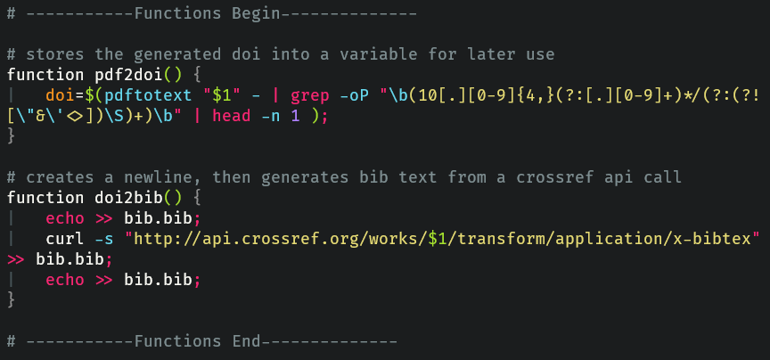
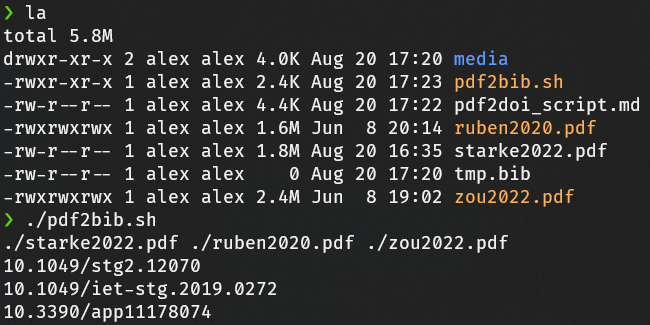
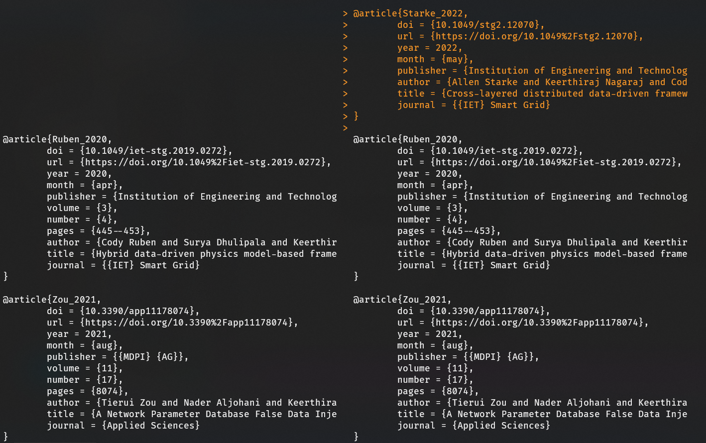

# Script to automatically generate .bib files
## Introduction
There are many ways to write and update bibliographies for academic papers. Websites can automatically compile a bib reference in your chosen format given the paper/book/article's digital ID. This process, however,  must be done manually, one reference at a time. 

Web apps like Overleaf allow for a streamlined experience integrating text-markup and rendering in real-time; if the process of creating/updating your paper's bibliography were just as streamlined, Overleaf would be perfect! One way to accomplish this is to use the command line interface to perform batch operations on a folder full of referenced files.

This script I've written, pdf2doi, will scan the directory in which it's placed for pdf files,  extract the paper's DOI, and then call the crossref.org API for a bibliography entry of that specific paper. The process is fully automatic, and only requires the user to keep all relevant pdfs in a single folder. For that purpose, the script, along with three academic papers for demonstration, are located in the 'papers' subdirectory.

In order to prevent excess queries to crossref.org's API, the script will *only* run if the number of pdfs to be processed has changed since the last time the script was called.

- Advantages:
    - Increased project organization and ability to quickly generate bib files.
    - Near instantaneous generation of bibliography files with a single script.
    - Small script size makes customization easy.
- Disadvantages:
    - Understanding the script takes time; Bugs and unexpected behavior might not be easily fixed.
    - Requires Python and a few other dependancies.
    - Requires Ubuntu (WSL2 for Windows) or similar Linux distro installed.
    - Project layout might be split between web app storage and PC storage.

## Requirements
In order to use this script, the following is required:
- Python 3 and the pdftotext package. You can find instructions here (https://pypi.org/project/pdftotext/).
    - You can check if your system has Python 3 installed by typing the following:
        > `python3 --version`

        And if it returns an error, follow the instructions here (https://www.makeuseof.com/install-python-ubuntu/).

    - You can install the pdftotext binary by typing the following:
        > `sudo apt install poppler-utils`

## Explanation
Scripting is the natural power of Linux, inherent in the ubiquitous presence of the terminal. Running a script is as simple as typing in a command and hitting enter, but the process of designing and editing scripts is anything but. In the following paragraphs, I will break down the details of a script I've written called pdf2bib. First, let's analyze the two functions pdf2doi and doi2bib.

The first function, pdf2doi, utilizes a Python script called "pdftotext" to convert a pdf into a text file. The file produced is largely unreadable, but is usually good enough to capture the raw text that makes up an academic paper.

The second function, doi2bib, runs a command called "curl" to request information from a website. That command queries the URL supplied, and returns the data present at that link, in the same way that your browser does. That website is crossref.org, which keeps the identification data on most academic papers in it's repositories. It's as simple as accessing a URL given the paper's DOI, and crossref.org will automatically return the formatted bibliography text.

It's possible to keep the pdfs and the script in a folder with many other filetypes, but keep in mind that any file ending with .pdf in the directory you execute the script in will be considered fair game.

Once executed, the script scans all the files in the current directory, only returning those ending in ".pdf", and supplies them as arguments to pdf2doi. pdf2doi calls the python function "pdftotext" and then runs a grep (Global Regular Expression Print) command which filters all that text for an expression of numbers that match the DOI template.

Those numbers are filtered for the best matching string for each file, and the list of results is supplied to doi2bib. The crossref.org API is then called for each entry in the list, which automatically returns x-bibtex formatted bibliography references for each entry. The newly created file replaces any previous version, if any, and moves the older file to an archive named "tmp.bib".

The archived .bib file will automatically be compared to the current .bib file using the "diff" command. The result will look like the image below. The archived file is on the left, and the new file is on the right. If there was a mistake, or if the wrong pdf files were changed, it will be shown here.

## TODOs and Possible Issues
- Rarely, no DOI can be found, and the script doesn't inform the user.
- Archive file management is not automated.

## Credits
This video (https://www.youtube.com/watch?v=nO4T8JDNYG0), and Nixcast's channel in general, is a great place to learn about using the terminal in an academic setting. The primary source for this script is the above video and various files on his github (https://github.com/connermcd).
